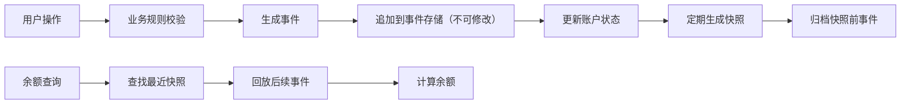

## 1. 产品概述

基于事件溯源（Event Sourcing）架构的账户记账系统，所有余额变更以追加事件方式存储，通过事件回放计算余额，支持任意时间点快照查询和账户事务时间线展示。

- **核心目标**：实现不可篡改的账户交易记录，确保账务可追溯、可审计
- **目标用户**：财务管理人员、系统运维人员、业务运营人员
- **核心价值**：提供完整的交易审计轨迹，支持历史任意时刻余额追溯，保证账务数据一致性

## 2. 核心功能

### 2.1 用户角色
| 角色 | 注册方式 | 核心权限 |
|------|----------|----------|
| 管理员 | 系统内置 | 账户操作、快照管理、事件查询、归档操作 |
| 操作员 | 系统分配 | 充值、消费、退款操作，查询账户状态 |

### 2.2 功能模块
1. **账户总览页**：账户余额展示、可用余额、冻结余额、状态标识
2. **事务时间线页**：事件列表展示、事件类型筛选、时间范围查询
3. **操作表单**：充值、消费、退款、冻结、解冻操作
4. **快照管理**：快照生成、快照列表、时间点余额查询
5. **补偿机制**：错误事件补偿、补偿事件记录

### 2.3 页面详情
| 页面名称 | 模块名称 | 功能描述 |
|----------|----------|----------|
| 账户总览 | 余额卡片 | 显示总余额、可用余额、冻结余额、账户状态 |
| 账户总览 | 快捷操作区 | 充值、消费、退款、冻结、解冻快捷按钮 |
| 账户总览 | 时间点查询 | 选择历史时间点查询当时余额 |
| 事务时间线 | 事件列表 | 按时间倒序展示所有事件，支持类型筛选 |
| 事务时间线 | 事件详情 | 点击事件查看完整信息（事件ID、单据号、金额、时间） |
| 事务时间线 | 时间范围筛选 | 按起止时间筛选事件记录 |
| 操作弹窗 | 充值表单 | 输入金额、业务单据号进行充值 |
| 操作弹窗 | 消费表单 | 输入金额、业务单据号进行消费（需校验可用余额） |
| 操作弹窗 | 退款表单 | 输入金额、业务单据号、关联原消费事件ID |
| 操作弹窗 | 冻结表单 | 输入冻结金额、业务单据号、冻结原因 |
| 操作弹窗 | 解冻表单 | 输入解冻金额、业务单据号 |
| 快照管理 | 快照列表 | 展示历史快照，含快照时间、余额、事件版本号 |
| 快照管理 | 生成快照 | 手动触发当前状态快照生成 |

## 3. 核心流程

### 3.1 账户操作流程
用户发起账户操作（充值/消费/退款/冻结/解冻）→ 系统校验业务规则（余额、状态等）→ 生成对应事件追加到事件存储 → 更新内存中账户状态 → 返回操作结果

### 3.2 余额查询流程
用户查询当前余额 → 查找最新快照 → 回放快照之后的所有事件 → 计算得出当前余额 → 返回结果

### 3.3 时间点余额查询流程
用户指定时间点 → 查找该时间点之前最近的快照 → 回放快照之后到指定时间点之前的所有事件 → 计算得出该时间点余额 → 返回结果

### 3.4 事件溯源流程图

## 4. 用户界面设计

### 4.1 设计风格
- **主色调**：深邃蓝 (#1e3a5f) 作为主色，代表专业、可信赖
- **辅助色**：翡翠绿 (#10b981) 表示充值/增加，珊瑚红 (#ef4444) 表示消费/减少，琥珀橙 (#f59e0b) 表示冻结
- **字体**：标题使用 "JetBrains Mono" 等宽字体，正文使用 "Inter" 无衬线字体，体现金融科技感
- **布局风格**：卡片式布局，左侧导航栏 + 右侧内容区，清晰的信息层级
- **图标风格**：使用线性图标，简洁专业，事件类型使用不同颜色和图标区分

### 4.2 页面设计概述
| 页面名称 | 模块名称 | UI 元素 |
|----------|----------|----------|
| 账户总览 | 余额卡片 | 大号数字显示余额，渐变背景，微动画效果，余额变化时数字滚动动画 |
| 账户总览 | 快捷操作区 | 图标按钮，悬停上浮效果，点击弹出模态框 |
| 账户总览 | 时间点查询 | 日期时间选择器，查询按钮，结果展示区域 |
| 事务时间线 | 事件列表 | 垂直时间线设计，每个事件节点带颜色标识，卡片悬停阴影效果 |
| 事务时间线 | 筛选区域 | 标签式筛选（全部/充值/消费/退款/冻结/解冻），日期范围选择器 |
| 操作弹窗 | 表单 | 半透明背景模糊效果，表单字段带图标，输入框焦点动画 |
| 快照管理 | 快照列表 | 数据表格，斑马纹，悬停高亮，操作列按钮 |

### 4.3 响应式
- **桌面优先**：1280px 以上分辨率最佳展示
- **平板适配**：768px-1280px，导航栏收起为图标模式
- **手机适配**：768px 以下，底部导航栏，卡片单列布局

### 4.4 动效设计
- 页面加载：卡片渐入 + 轻微上浮动画， staggered 延迟效果
- 余额更新：数字滚动动画，从旧值平滑过渡到新值
- 事件追加：新事件从顶部滑入，高亮闪烁提示
- 模态框：背景模糊渐变，表单从上往下滑入
- 按钮交互：悬停时轻微放大，点击时收缩反馈
