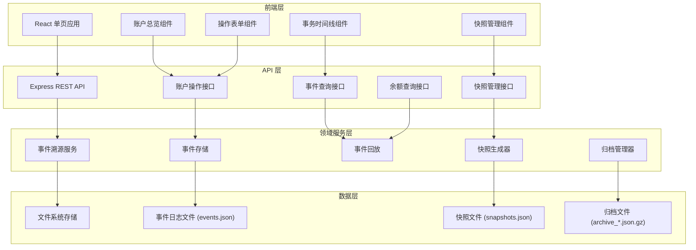
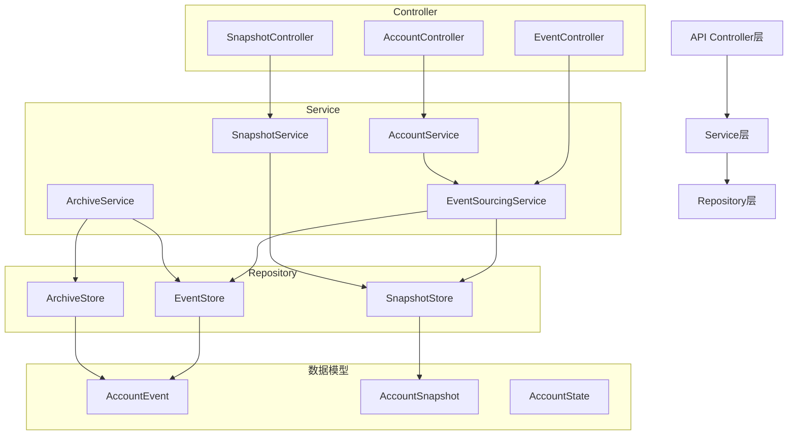
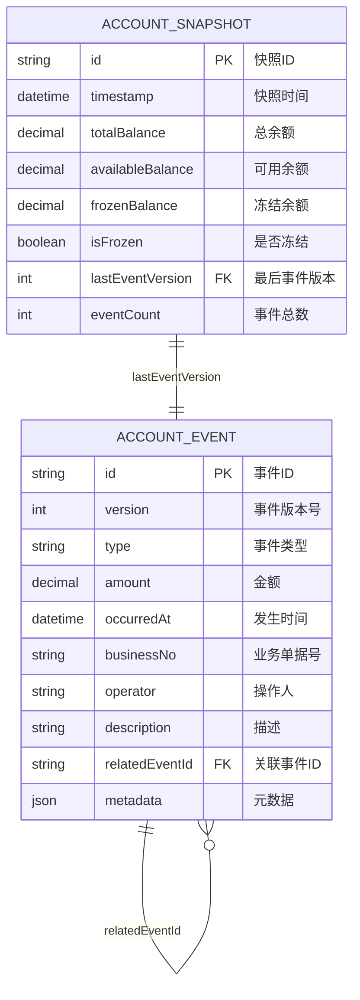

## 1. 架构设计



## 2. 技术描述

- **前端**：React@18 + TypeScript + tailwindcss@3 + Vite
- **初始化工具**：Vite
- **后端**：Express@4 + TypeScript
- **数据存储**：文件系统（JSON 文件存储，便于演示和理解事件溯源核心概念）
- **压缩库**：zlib（Node.js 内置，用于事件归档压缩）
- **UI 组件库**：lucide-react（图标库）

## 3. 路由定义

### 前端路由
| 路由 | 页面 | 用途 |
|------|------|------|
| / | 账户总览 | 展示账户余额、快捷操作、时间点查询 |
| /timeline | 事务时间线 | 展示所有事件记录，支持筛选查询 |
| /snapshots | 快照管理 | 管理快照，查看历史快照列表 |

### API 路由
| 路由 | 方法 | 用途 |
|------|------|------|
| /api/account/balance | GET | 查询当前账户余额 |
| /api/account/balance/:timestamp | GET | 查询指定时间点的账户余额 |
| /api/account/recharge | POST | 充值操作 |
| /api/account/consume | POST | 消费操作 |
| /api/account/refund | POST | 退款操作 |
| /api/account/freeze | POST | 冻结操作 |
| /api/account/unfreeze | POST | 解冻操作 |
| /api/account/compensate | POST | 补偿操作 |
| /api/events | GET | 查询事件列表（支持分页、筛选） |
| /api/events/:id | GET | 查询单个事件详情 |
| /api/snapshots | GET | 查询快照列表 |
| /api/snapshots | POST | 手动生成快照 |
| /api/snapshots/latest | GET | 获取最新快照 |
| /api/archive | POST | 触发归档操作 |

## 4. API 定义

### TypeScript 类型定义

```typescript
// 事件类型枚举
enum EventType {
  RECHARGE = 'recharge',      // 充值
  CONSUME = 'consume',        // 消费
  REFUND = 'refund',          // 退款
  FREEZE = 'freeze',          // 冻结
  UNFREEZE = 'unfreeze',      // 解冻
  COMPENSATE = 'compensate'   // 补偿
}

// 账户事件接口
interface AccountEvent {
  id: string;                 // 事件唯一标识
  version: number;            // 事件版本号（递增）
  type: EventType;            // 事件类型
  amount: number;             // 金额
  occurredAt: string;         // 发生时间 ISO 格式
  businessNo: string;         // 关联业务单据号
  operator: string;           // 操作人
  description?: string;       // 描述
  relatedEventId?: string;    // 关联事件ID（如退款关联消费）
  metadata?: Record<string, any>; // 扩展元数据
}

// 账户快照接口
interface AccountSnapshot {
  id: string;                 // 快照ID
  timestamp: string;          // 快照时间
  totalBalance: number;       // 总余额
  availableBalance: number;   // 可用余额
  frozenBalance: number;      // 冻结余额
  isFrozen: boolean;          // 是否冻结状态
  lastEventVersion: number;   // 对应最后一个事件版本号
  eventCount: number;         // 累计事件数
}

// 账户状态接口
interface AccountState {
  totalBalance: number;
  availableBalance: number;
  frozenBalance: number;
  isFrozen: boolean;
  lastEventVersion: number;
}

// API 请求/响应

interface OperationRequest {
  amount: number;
  businessNo: string;
  operator: string;
  description?: string;
  relatedEventId?: string;
}

interface BalanceResponse {
  totalBalance: number;
  availableBalance: number;
  frozenBalance: number;
  isFrozen: boolean;
  timestamp: string;
  calculatedFrom: 'snapshot' | 'beginning';
  eventReplayed: number;
}

interface EventListResponse {
  items: AccountEvent[];
  total: number;
  page: number;
  pageSize: number;
}

interface ApiResponse<T> {
  success: boolean;
  data?: T;
  error?: string;
  message?: string;
}
```

### 服务端架构图



## 5. 数据模型

### 5.1 数据模型定义



### 5.2 核心业务规则

1. **事件不可修改**：所有事件一旦写入事件存储，永远不可修改或删除。如需修正错误，必须追加补偿事件。
2. **余额计算**：余额通过事件回放计算得出，公式如下：
   - 总余额 = 初始余额 + Σ(充值金额 + 退款金额) - Σ(消费金额)
   - 冻结余额 = Σ(冻结金额) - Σ(解冻金额)
   - 可用余额 = 总余额 - 冻结余额
3. **消费校验**：消费操作必须校验可用余额 >= 消费金额，否则拒绝。
4. **冻结校验**：冻结操作必须校验可用余额 >= 冻结金额，否则拒绝。
5. **解冻校验**：解冻操作必须校验冻结余额 >= 解冻金额，否则拒绝。
6. **冻结期间限制**：当账户处于冻结状态（isFrozen = true）时，所有消费请求被拒绝。
7. **快照触发**：当事件数量达到阈值（如100条）或定时触发（如每小时）生成快照。
8. **归档规则**：新快照生成后，将之前的事件归档压缩，仅保留快照和后续事件用于快速计算。

### 5.3 存储文件格式

**events.json** 格式：
```json
{
  "events": [
    {
      "id": "evt_001",
      "version": 1,
      "type": "recharge",
      "amount": 1000,
      "occurredAt": "2024-01-01T10:00:00.000Z",
      "businessNo": "BIZ20240101001",
      "operator": "admin",
      "description": "初始充值"
    }
  ],
  "lastVersion": 1
}
```

**snapshots.json** 格式：
```json
{
  "snapshots": [
    {
      "id": "snap_001",
      "timestamp": "2024-01-01T12:00:00.000Z",
      "totalBalance": 1000,
      "availableBalance": 1000,
      "frozenBalance": 0,
      "isFrozen": false,
      "lastEventVersion": 50,
      "eventCount": 50
    }
  ]
}
```
